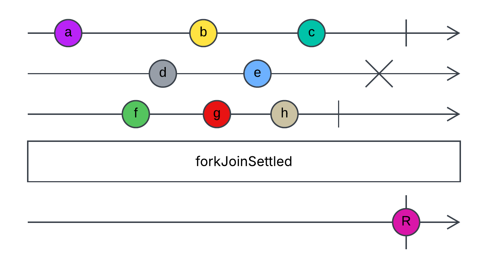

# fork-join-settled

[RxJS](https://rxjs.dev/) library which is analog of [Promise.allSettled()](https://developer.mozilla.org/en-US/docs/Web/JavaScript/Reference/Global_Objects/Promise/allSettled) method.

### Motivation

Mostly I use [`forkJoin`](https://rxjs.dev/api/index/function/forkJoin) when I need to make an parallel requests. But it throws an error if any given observable throws an error at some point. In rare cases I want to get some partial results from requests (at least results that were completed successfully). Unfortunatly, it's imposible with `forkJoin`.

There is a solution in native JS - `Promise.allSettled()` static method. But I like RxJS and don't want to use Promises in my, for example `Angular` projects. That's how idea of this library was born.

### Description

> Wait for Observables to complete and then emit (and complete) an array of objects that describe the outcome of each observable; complete immediately if an empty array is passed.



Where `R` is an array of objects that describe the outcome of each observable (in the same order they were passed); each object has following properties:

- **status** - string, either "fulfilled" or "rejected", indicating the eventual state of the observable;
- **value** - only present if status is "fulfilled"; the value that the observable was completed with;
- **reason** - only present if status is "rejected"; the error that the observable was completed with.

### Difference from [forkJoin](https://rxjs.dev/api/index/function/forkJoin)

As I said before `forkJoin` operator will completed with error if any of given observables throws an error. `forkJoin Settled` will never completed with error. It maps an error to object with "rejected" status. Value from observable it maps to object with "fulfilled" status.

### Usage

1. Install the library:

```bash
npm i fork-join-settled
```

2. Import to your file:

```ts
import { forkJoinSettled } from 'fork-join-settled';
```

3. Use wherever you need:

```ts
forkJoinSettled([...])
```

You can look up in test file `./src/fork-join-settled.spec.ts` to see how to use operator.

### Parameters

- **sources** - an array of observables.

### Contributing

If you have any suggestions, ideas, or problems, feel free to create an issue or PR.
